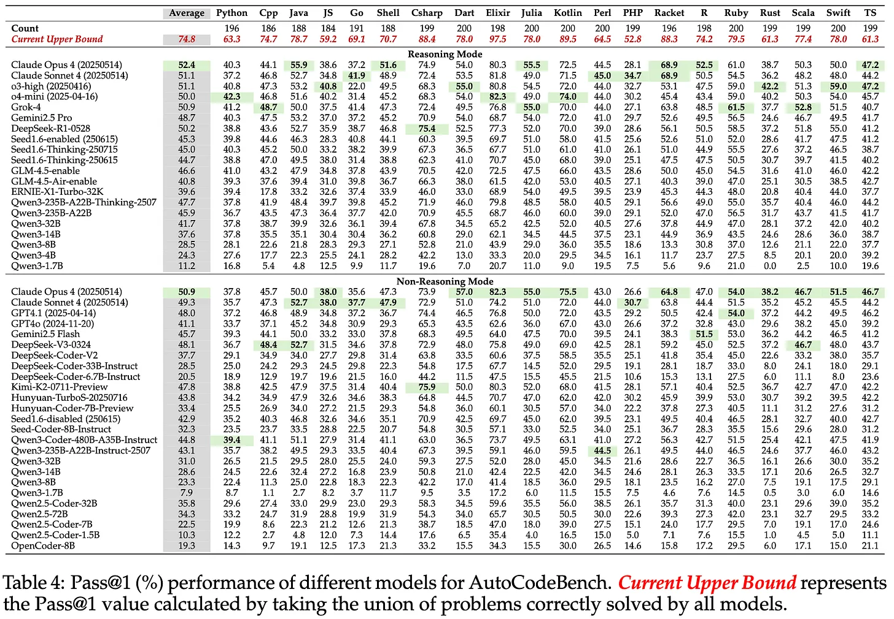

+++
title = "What will the future of programming look like?"
date = 2026-03-17
+++

*If you would like to watch a video version of this post, check it out
[here](https://www.youtube.com/watch?v=cTU9fMqiGVI).*

---

I’ve been getting into programming language development, compilers, and more recently.

And I’ll be honest: I’ve been having a bit of an existential crisis given the state of the technology industry, AI, etc.

There’s been some pretty brazen predictions out there, but they have got me thinking:

What does the future of programming look like?

Programming languages can take a very, very long time to make and eventually reach maturity. So do you just ignore AI  and expect it to be something that’s just going to blow over, or do you build your language with LLMs in mind?

I stumbled across a [blog post](https://ryelang.org/blog/posts/programming-language-in-age-of-llms/) by a developer working on the Rye programming language. In it, they talk about similar questions and concerns, and so I thought I would go over some of the sections here.

## Generating code

One of the first things they mention is that whether you like it or not, and whether you use the tools or not, people out there are using these tools to generate code. Even if you’re not using agents or keeping up with the AI zeitgeist, using an LLM like a search engine still produces generated code.

People are using them, and we don’t know how this trend will continue to grow or change.

We’ve seen some interesting things here related to programming languages already. Elixir, for example, has documentation attributes baked into the language which has inadvertently caused it to [score quite well on Tencent’s LLM benchmark](https://autocodebench.github.io/).

On the other side of things, there is an amazing quote (or question) in this blog post:

> Is natural language the best substrate to declare what you want from a computer?

And my answer at least is probably, no.

Natural language has a lot of nuance, words can have different meanings in different contexts, and I think this is partly the reason why people get frustrated with these tools.

You have to specify exactly what you want your program to do, and at that point you aren’t far off normal programming languages to be honest. Dijkstra also has a famous essay titled “[On the foolishness of "natural language programming"](https://www.cs.utexas.edu/~EWD/transcriptions/EWD06xx/EWD667.html)”.

## The innovation outside of LLMs

Outside of AI and everything happen there, we have seen a lot of cool and interesting programming languages come into the spotlight: Rust, Lean, and Gleam just to name a few.

I just think that there’s so so many languages out there designed to solve different problems, and so many different ways to write software that we’re going need humans to understand this translation layer. But who knows, maybe I’ll be proven wrong.

My conviction is that we’re still going to need different programming languages out there, even if AI/LLMs becomes the top layer - but maybe that’s copium as someone exploring this field more.

## Answering the question

I realise that throughout this post I haven’t actually answered the question in the title, and I’m probably going to disappoint some people here and say that I don’t know what the future will look like for programming languages.

I’ll share some thoughts though of some things which I think we might see:

- A continuation of FP concepts being added to mainstream languages, and a continued focus on “multi-paradigm” languages which pull the best parts from different languages out there
- Some kind of renewed focus on formal verification and adjacent areas, as at the end of the day a level of determinism in important for programs

## Closing thoughts

As someone learning more about PL theory, functional programming, compilers, etc. I’ll be honest: I’m a little scared, and I have no idea if exploring all of these topics will end up being a bad decision. 

But I think I’ll be happy that I’m learning about it anyway because I enjoy it. 

If you want to read more posts on functional programming, PL development, and my self-learning approach to these things, feel free to subscribe.

Thanks for reading.

---

*Enjoyed this post? Subscribe to my Substack for email updates, or check out my videos.*
